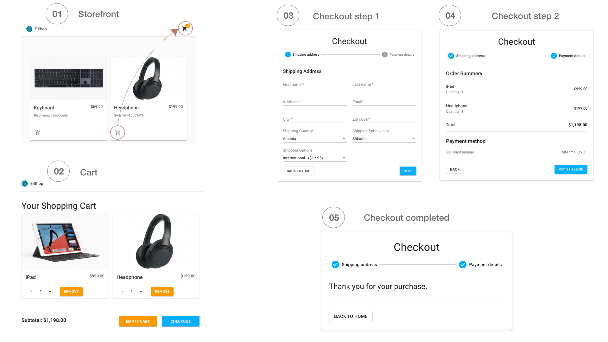

# E-Commerce store with ReactJS

[Demo app](https://e-shop-dbc41.web.app)
NOTE: User might experience slow loading due calling API server.

A simple e-commerce website with commerce.js API integrated and dummy products displayed on the cards. Checkout functionality implemented with shipping options and Stripe payment handler.

## Dependencies

- Producs API: [Chec/Commerce.js](https://commercejs.com/)
- Payment option: [React Stripe.js](https://stripe.com/docs/stripe-js/react)
- Cards & grids from: [Material-UI](https://material-ui.com/getting-started/installation/)
- Carousel from: [React-bootstrap](https://react-bootstrap.github.io/)

## Screenshots

